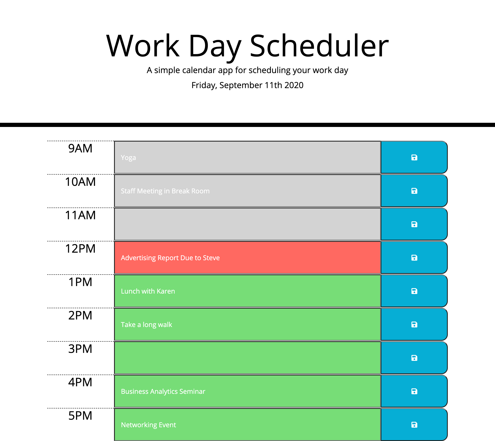

**Work Day Scheduler**

This application allows the user to write and store hourly tasks in daily scheduler. The scheduler dynamically changes to reflect the current time. The current time slot is red, future time slots are green, and time slots that have past are greyed out. The user data is stored locally so it will be loaded in the correct time slot regardless of a refreshed/reloaded page.  

Deployed Website: https://kevinconnell96.github.io/workDayScheduler_KTC/